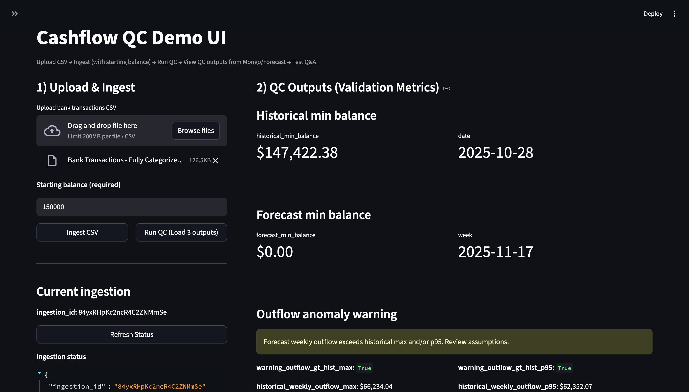
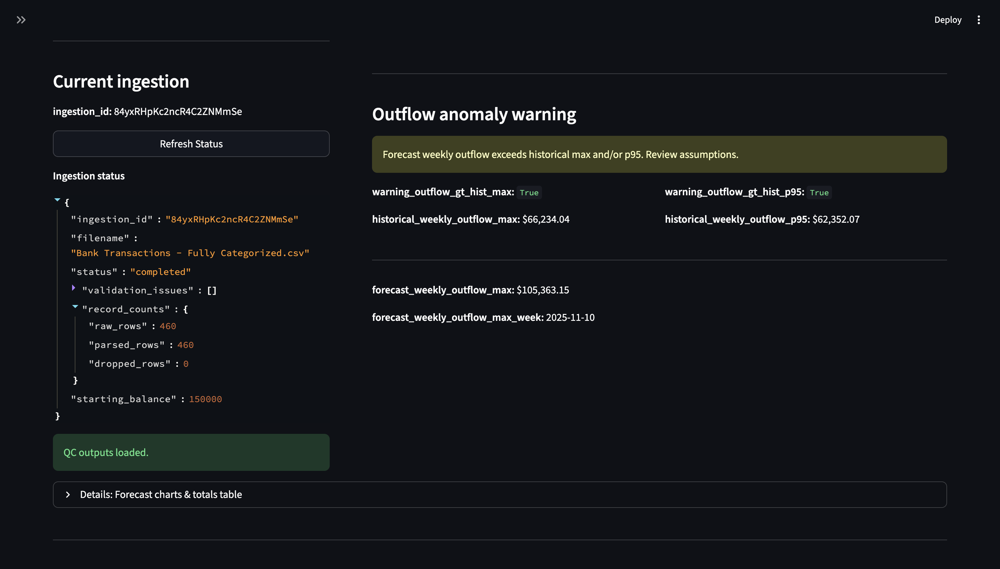
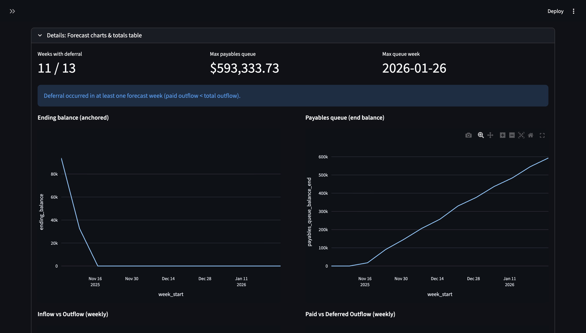
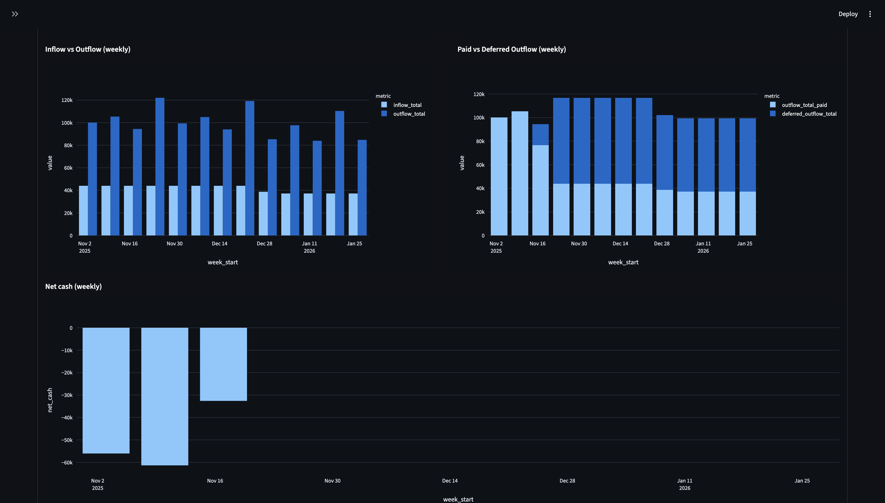

# Cashflow Management

> A production-style cashflow forecasting and quality-control system for small businesses


## 🎯 Overview

**Cashflow Management** is a comprehensive backend system that ingests historical bank transactions, produces 13-week cashflow forecasts, enforces non-negative balances, models cash shortfalls via deferral into a payables queue, and supports grounded Q&A over forecast outputs.

This project demonstrates production-grade backend engineering, data modeling, forecasting logic, QA checks, and retrieval-augmented generation (RAG) in a cohesive financial system.

### Key Questions This System Answers

- ✅ Will I run out of cash in the next 13 weeks?
- ✅ When does deferral occur due to insufficient cash?
- ✅ How much spending is paid vs deferred each week?
- ✅ Which week has the lowest balance or highest outflow risk?
- ✅ Can I ask natural-language questions grounded in forecast data?

## ✨ Features

### Core Capabilities

- **CSV Ingestion** - Import and normalize bank transaction data
- **Weekly Aggregation** - Automatic calculation of inflow/outflow/net cash
- **13-Week Forecasting** - Forward-looking cashflow projections
- **Accounting Invariants** - Guaranteed financial consistency:
  - Ending balance is never negative
  - `outflow_total = outflow_total_paid + deferred_outflow_total`
- **Payables Queue Modeling** - Explicit tracking of deferred cash outflows
- **Category & Vendor Breakdowns** - Detailed spending analysis
- **Recurring Payment Detection** - Identify and forecast regular expenses
- **QA Metrics** - Minimum balance tracking and anomaly detection
- **Grounded Q&A** - RAG-powered question answering via Pinecone + Gemini
- **Interactive UI** - Streamlit dashboard for forecast inspection

## 🏗️ Architecture

```
CSV File
  ↓
FastAPI API (Ingest + Forecast + QA)
  ↓
Aggregation & Forecasting (deferrals + QA checks)
  ↓
MongoDB (transactions + forecast artifacts + knowledge packages)
  ↓
Pinecone (indexed forecast chunks)
  ↓
Gemini (answers grounded only in retrieved records)
  ↓
Streamlit UI (QC dashboard + Q&A)
```

## 🛠️ Tech Stack

### Backend
- **FastAPI** - High-performance API framework
- **Uvicorn** - ASGI server

### Data & Storage
- **MongoDB** - Raw CSV, normalized transactions, aggregates, forecasts, knowledge packages

### Forecasting & Analytics
- **pandas, NumPy** - Data aggregation and transformations
- **XGBoost** - Category-level variable forecasting
- **QA Checks** - Minimum balance and outflow anomaly detection

### RAG / Retrieval
- **Pinecone** - Vector index for forecast knowledge packages
- Deterministic vector IDs per ingestion/type/week for reliable fetch
- Lightweight deterministic embedding fallback (hash embedding) for development

### LLM
- **Google Gemini** - Grounded answer generation strictly from supporting records

### UI
- **Streamlit** - Interactive dashboard
- **Plotly** - Data visualization

### Infrastructure
- **Docker Compose** - MongoDB containerization
- **.env** - Configuration management

## 📊 Key Accounting Rules

The system enforces the following invariants for **every forecast week**:

1. ✅ **Non-negative ending balance**
2. ✅ **Paid + Deferred = Total outflow**
3. ✅ **Deferred outflows accumulate into a payables queue**
4. ✅ **Payables queue is monotonic unless explicitly paid down**

This ensures the forecast is financially consistent and auditable.

## 📁 Project Structure

```
FINZ-assignment/
├── app/
│   ├── db/
│   │   └── mongo.py                 # MongoDB connection
│   ├── routes/
│   │   ├── cashflow.py              # Ingest + forecast APIs
│   │   └── qa.py                    # Grounded Q&A endpoint
│   ├── services/
│   │   ├── aggregation.py           # Core cashflow logic + QA checks
│   │   ├── xgb_forecast.py          # Category-level XGBoost forecasting
│   │   ├── knowledge_package.py     # Persisted forecast artifacts
│   │   ├── pinecone_index.py        # Vector indexing & retrieval
│   │   └── gemini_qa.py             # LLM grounded answer generation
│   ├── utils/
│   │   └── parsing.py               # CSV normalization & validation
│   └── main.py                      # FastAPI entrypoint
├── ui/
│   ├── app.py                       # Streamlit dashboard
│   └── requirements.txt             # Python dependencies
├── Bank Transactions - Fully Categorized.csv  # Sample data
├── 1.png                            # UI screenshots
├── 2.png
├── 3.png
├── 4.png
├── 5.png
├── docker-compose.yml
├── .env.example
├── .gitignore
└── README.md
```

> **Note:** UI screenshots (1.png - 5.png) are located in the repository root. See the [Screenshots section](#-screenshots--ui-walkthrough) below for detailed UI walkthrough.

## 📦 Sample Data

A sample cleaned CSV is included: `Bank Transactions - Fully Categorized.csv`

### Required CSV Columns

| Column | Description |
|--------|-------------|
| `date` | Transaction date |
| `amount` | Positive = inflow, Negative = outflow |
| `category_normalized` | Standardized category |
| `vendor_normalized` | Standardized vendor name |

> **Note:** If using your own CSV, ensure it's already cleaned and categorized into the required schema.

## ⚙️ Requirements

### Recommended
- Python 3.9+ (3.10/3.11 also supported)
- Docker + Docker Compose (for MongoDB)
- Pinecone account (for vector indexing)
- Google Gemini API key (for Q&A)

### Environment Variables

Create a `.env` file with the following:

```bash
MONGO_URI=mongodb://localhost:27017
PINECONE_API_KEY=your_key_here
PINECONE_INDEX_NAME=cashflow-index
GOOGLE_API_KEY=your_gemini_key

# Optional
PINECONE_NAMESPACE=cashflow
GEMINI_MODEL=gemini-1.5-flash
```

## 🚀 Installation & Setup

### 1. Clone the Repository

```bash
git clone https://github.com/<your-username>/cashflow-management.git
cd cashflow-management
```

### 2. Create and Activate Virtual Environment

```bash
python3 -m venv .venv
source .venv/bin/activate  # On Windows: .venv\Scripts\activate
```

### 3. Upgrade pip Tooling (Recommended)

```bash
python -m pip install --upgrade pip setuptools wheel
```

### 4. Install Python Dependencies

```bash
pip install -r ui/requirements.txt
```

> **macOS Note:** If you encounter build issues for XGBoost, ensure Xcode Command Line Tools are installed:
> ```bash
> xcode-select --install
> ```

### 5. Create Environment File

```bash
cp .env.example .env
# Edit .env with your actual credentials
```

### 6. Start MongoDB

```bash
docker compose up -d
```

## 🎬 Running the Application

### Start the FastAPI Backend

```bash
uvicorn app.main:app --reload
```

Backend runs at: **http://127.0.0.1:8000**

### Start the Streamlit UI

```bash
streamlit run ui/app.py
```

UI runs at: **http://localhost:8501**

## 💡 Using the UI

1. **Upload a CSV** (or use the included sample)
2. **Enter a starting bank balance**
3. **Click "Ingest CSV"**
4. **Click "Run QC (Load outputs)"**
5. **Inspect:**
   - Historical and forecast minimum balance
   - Paid vs deferred outflows
   - Payables queue growth
6. **Ask grounded questions** like:
   ```
   "In week 2025-11-17, how much outflow was paid vs deferred 
   and what was the payables queue end balance?"
   ```

## 🔌 API Endpoints

### Ingestion

**POST** `/cashflow/ingest`
- Multipart form: `file` + `starting_balance`
- Returns: `ingestion_id`

**GET** `/cashflow/ingest/{ingestion_id}/status`
- Returns: ingestion status + counts

### Forecasting

**GET** `/cashflow/forecast?ingestion_id=...`
- Returns: 13-week totals + deferral fields + QA checks

**GET** `/cashflow/forecast/categories?ingestion_id=...`
- Returns: category breakdown with method tags (baseline / xgboost)

**GET** `/cashflow/forecast/vendors?ingestion_id=...`
- Returns: top vendors breakdown

### Q&A

**POST** `/cashflow/qa`
- JSON body: `ingestion_id`, `question`, `top_k`
- Returns: `answer` + `supporting_records`

## 📸 Screenshots / UI Walkthrough

### 1. CSV Upload & Ingestion


**Upload & ingestion of CSV with starting balance and initialization of QC.** The interface allows users to upload historical transaction data and set an initial bank balance to begin the forecasting process.

---

### 2. Ingestion Status & QC Validation


**Ingestion status and QC validation metrics (historical min, forecast min, anomaly warnings).** The system displays comprehensive validation results including minimum balance thresholds and automated anomaly detection across the forecast horizon.

---

### 3. Deferral Summary & Liquidity Analysis


**Deferral summary showing weeks with deferral, max payables queue, and liquidity stress.** Critical insights into cash shortfall periods, peak deferred obligations, and liquidity risk indicators help identify potential cash constraints.

---

### 4. Forecast Visualization & Analytics


**Forecast charts including ending balance, payables queue growth, inflow vs outflow, and paid vs deferred outflow.** Interactive visualizations provide a comprehensive view of projected cash positions, payment capabilities, and the accumulation of deferred obligations over the 13-week forecast period.

---

### 5. Grounded Q&A with RAG


**Grounded Q&A over forecast data with traceability to supporting records.** Natural language queries are answered using retrieval-augmented generation, with responses strictly grounded in actual forecast data and supporting evidence displayed for full auditability.

## 🎓 Why This Project Matters

This is **not a toy forecast**.

It enforces cash constraints, models unpaid obligations explicitly, produces auditable outputs, and supports grounded Q&A with traceability back to stored forecast artifacts.

The system demonstrates production-grade engineering practices including:
- Financial invariant enforcement
- Comprehensive data validation
- RAG-based knowledge retrieval
- Auditable forecast generation

## 🚀 Future Extensions

- [ ] Pay-down strategy for payables queue
- [ ] Confidence intervals / scenario simulation
- [ ] Multi-account support
- [ ] Exportable CFO-style reports
- [ ] Auth + multi-tenant support
- [ ] Real-time bank integration
- [ ] Custom forecasting models per business type

## 📄 License

MIT License - see [LICENSE](LICENSE) file for details

## 👤 Author

**Shreyas Khandale**  
MS Computer Science (AI Track)  
Binghamton University

---

⭐ If you find this project useful, please consider giving it a star!

## 📞 Contact & Contributions

Issues and pull requests are welcome! For major changes, please open an issue first to discuss what you would like to change.
